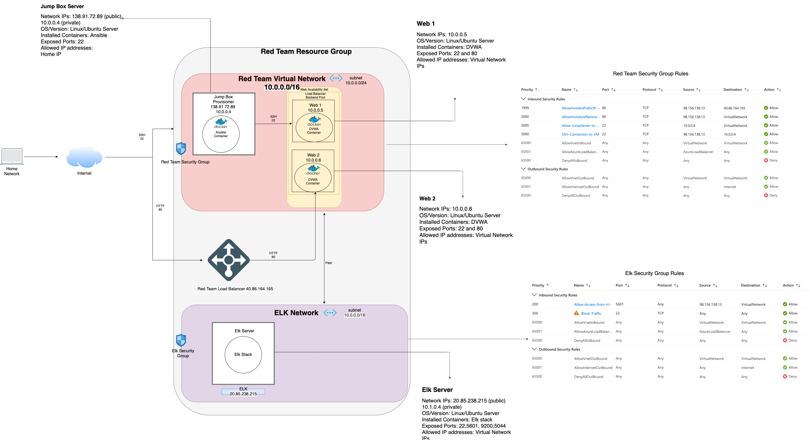

## Automated ELK Stack Deployment

The files in this repository were used to configure the network depicted below.

These files have been tested and used to generate a live ELK deployment on Azure. They can be used to either recreate the entire deployment pictured above. Alternatively, select portions of the _YAML____ file may be used to install only certain pieces of it, such as Filebeat.

  - _TODO: Enter the playbook file._

This document contains the following details:
- Description of the Topology
- Access Policies
- ELK Configuration
  - Beats in Use
  - Machines Being Monitored
- How to Use the Ansible Build

### Description of the Topology

The main purpose of this network is to expose a load-balanced and monitored instance of DVWA, the D*mn Vulnerable Web Application.

Load balancing ensures that the application will be highly __available by forwarding traffic from specific ports to the backend pool_on specific ports_, in addition the jump box server functions to restrict __access___ to the network.
- _TODO: What aspect of security do load balancers protect? What is the advantage of a jump box?_

Integrating an ELK server allows users to easily monitor the vulnerable VMs for changes to the system log files in web-1 and web-2 virtual networks using Filebeat software in addition to machine metrics, such as uptime with metricbeat software.
- _TODO: What does Filebeat watch for?_log events
- _TODO: What does Metricbeat record?_ log files

The configuration details of each machine may be found below.
_Note: Use the [Markdown Table Generator](http://www.tablesgenerator.com/markdown_tables) to add/remove values from the table_.

| Name     | Function | IP Address | Operating System |
|----------|----------|------------|------------------|
| Jump Box |Gateway    | 10.0.0.4   |Linux/Ubuntu 18.04|
| Web-1    |Webserver  | 10.0.0.5   |Linux/Ubuntu 18.04|
| Web-2    |Webserver  | 10.0.0.6   |Linux/Ubuntu 18.04|
|Elk-Server|Webserver  | 10.1.0.4   |Linux/Ubuntu 18.04|

### Access Policies

The machines on the internal network are not exposed to the public Internet. 

Only the Jump-Box Provisioner machine can accept connections from the Internet. Access to this machine is only allowed from the following IP addresses: 98.156.138.13
- _TODO: Add whitelisted IP addresses_

Machines within the network can only be accessed by the Jump-Box Provisioner (10.0.0.4).
- _TODO: Which machine did you allow to access your ELK VM? What was its IP address?_

A summary of the access policies in place can be found in the table below.

| Name     | Publicly Accessible | Allowed IP Addresses |
|----------|---------------------|----------------------|
| Jump Box | Yes/No              |  98.156.138.13/10.0.0.4|
| Web 1    | No/No               |  10.0.0.5/         |
| Web 2    | No/No               |  10.0.0.6       |
| ELK      | No/No               |  10.1.0.4           |

### Elk Configuration

Ansible was used to automate configuration of the ELK machine. No configuration was performed manually, which is advantageous because it allows you to configure multiple machines simultaneously. 
- _TODO: What is the main advantage of automating configuration with Ansible?_

The playbook implements the following tasks:
- _TODO: In 3-5 bullets, explain the steps of the ELK installation play. E.g., install Docker; download image; etc._
- Install docker.io using apt module.
- Install python3-pip using apt module.
- Install docker module using the pip module.
- Increase virtual memory using sysctl module.
- Download and launch a docker elk container using docker_container module.

The following screenshot displays the result of running `docker ps` after successfully configuring the ELK instance.

### Target Machines & Beats
This ELK server is configured to monitor the following machines:
- Web-1 (10.0.0.5)
- Web-2 (10.0.0.6)

We have installed the following Beats on these machines:
- Filebeat
- Metricbeat

These Beats allow us to collect the following information from each machine:
- _TODO: In 1-2 sentences, explain what kind of data each beat collects, and provide 1 example of what you expect to see. E.g., `Winlogbeat` collects Windows logs, which we use to track user logon events, etc._

### Using the Playbook
In order to use the playbook, you will need to have an Ansible control node already configured. Assuming you have such a control node provisioned: 

SSH into the control node and follow the steps below:
- Copy the install-elk.yml file to etc/ansible/roles/install-elk/tasks.
- Update the etc/ansible/hosts file to include the groups specified in brackets [Elk], in addition to the Elk-Server IP address "10.1.0.4" followed by ansible_python_interpreter=usr/bin/python3.
- Run the playbook, and navigate to  http://[elk-server-ip]:5601/app/kibana#/home to check that the installation worked as expected.

Use the following command to run, download the playbook, update the files, etc.:

Command to verify that the container is on:

$ docker container list -a

Commands to open Ansible container:

$ sudo docker start <container_name>

$ sudo docker attach <container_name>

$ cd <desired directory>

Command to update host file:

$ sudo nano /etc/ansible/hosts/

Command to update configuration files with correct IP addresses and ports:

sudo nano <name-config file>

Command to create a playbook:

$ nano playbook-name.yml

Command to run the playbook:

$ ansible-playbook <playbook-name.yml>

